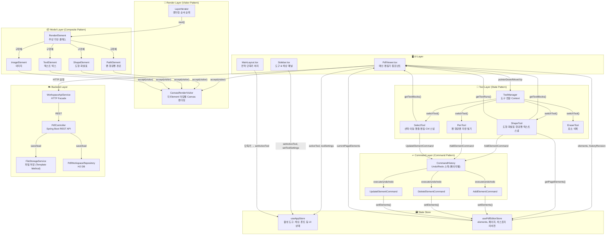

# PDF Editor App

PDF 및 이미지 파일에 필기, 주석, 도형을 추가할 수 있는 Electron 기반 데스크탑 편집 애플리케이션입니다.

---

## 🚀 실행 방법

```bash
# 터미널 1: Vite 개발 서버
npm run dev:vite

# 터미널 2: Electron (5초 후)
npm run dev:electron

# 또는 한 번에
npm run dev
```

백엔드 (Spring Boot):
```bash
cd backend
./gradlew bootRun
```

---

## 🛠️ 기술 스택

- **Frontend**: React + TypeScript + Vite + Tailwind CSS
- **Desktop**: Electron
- **PDF 렌더링**: PDF.js
- **PDF 편집/저장**: pdf-lib
- **Backend**: Kotlin + Spring Boot + H2 Database
- **아키텍처**: Visitor Pattern, Command Pattern, Strategy Pattern, Factory Method, Iterator, Proxy, Mediator, State, Flyweight, Decorator Pattern

---

## ✏️ 편집 도구 완전 가이드

### 도구 목록 및 단축키

| 도구 | 단축키 | 설명 |
|------|--------|------|
| 선택 | `S` | 요소 선택, 이동, 크기 조절 |
| 펜 | `P` | 자유 필기 |
| 형광펜 | `H` | 반투명 마커 (텍스트 스냅 지원) |
| 텍스트 | `T` | 텍스트 박스 생성 및 편집 |
| 사각형 | `Q` | 사각형 도형 |
| 원 | `C` | 타원형 도형 |
| 지우개 | `E` | 요소 삭제 |
| 화살표 | `3` | 방향 자동 감지 화살표 |
| 꺾임 (원형) | `1` | ㄱ자형 화살표 |
| 꺾임 (세로형) | `2` | ┌자형 화살표 |
| 이미지 | `I` | 이미지 파일 삽입 |

### 선택 도구 (S)
- 요소 클릭으로 선택
- 드래그로 이동
- **화살표 선택 시**: 시작점(초록), 끝점(빨강) 핸들 표시 → 드래그로 방향·길이 조정
- **도형/이미지 선택 시**: 4개 모서리 핸들 표시 → 드래그로 크기 조절
- **Ctrl + 드래그**: PDF 텍스트, 텍스트 박스, 모든 도형 경계에 자동 스냅

### 펜 도구 (P)
- 마우스 드래그로 자유 필기
- 색상, 두께 설정 가능

### 형광펜 도구 (H)
- 반투명 마커 효과
- **텍스트 스냅 기능**:
  - 드래그 중: raw 드래그 rect 미리보기
  - 마우스 업 시: 드래그 rect에 걸친 글자들의 실제 bounding box로 자동 확장
  - 다른 줄 침범 방지 (텍스트 런 Y 범위 기준)
  - 글자 너비 정밀 계산 (`ctx.measureText()` 기반)

### 텍스트 도구 (T)
- PDF 빈 공간 클릭 → 새 텍스트 박스 생성
- 기존 텍스트 박스 클릭 → 편집 모드
- **실시간 미리보기**: 타이핑 시 canvas에 즉시 반영
- V체크 또는 Ctrl+Enter로 완료
- 폰트, 크기, 색상 설정 가능
- 박스 투명도 슬라이더로 배경 조절

### 화살표 도구 (3)
- 드래그 방향으로 자동 화살표 방향 결정 (상/하/좌/우)
- **Ctrl + 드래그**: 시작점/끝점이 PDF 텍스트, 텍스트 박스, 도형 경계에 스냅

### 꺾임 화살표 (1, 2)
- `1`: ㄱ자형 (오른쪽→아래)
- `2`: ┌자형 (아래→오른쪽)
- **Ctrl + 드래그**: 텍스트 및 도형 경계 스냅

### 이미지 도구 (I)
- 클릭 시 파일 탐색기 오픈 (PNG, JPG 등)
- 클릭 위치에 이미지 삽입
- 삽입 후 자동으로 선택 도구로 전환
- 선택 도구로 크기/위치 조절 가능

### 사각형/원 도구 (Q, C)
- 드래그로 크기 결정
- 원은 타원형 지원 (가로/세로 자유 조절)
- **텍스트 스냅**: 형광펜과 동일하게 PDF 텍스트 영역에 맞게 자동 조정

---

## ⌨️ 전체 단축키

### 파일
| 단축키 | 기능 |
|--------|------|
| `Ctrl + O` | 파일 열기 |
| `Ctrl + S` | 저장 |
| `Ctrl + Shift + S` | 다른 이름으로 저장 |

### 편집
| 단축키 | 기능 |
|--------|------|
| `Ctrl + Z` | 실행 취소 |
| `Ctrl + Y` | 다시 실행 |
| `Delete` / `Backspace` | 선택 요소 삭제 |

### 도구
| 단축키 | 도구 |
|--------|------|
| `S` | 선택 |
| `P` | 펜 |
| `H` | 형광펜 |
| `T` | 텍스트 |
| `Q` | 사각형 |
| `C` | 원 |
| `E` | 지우개 |
| `3` | 화살표 |
| `1` | 꺾임 (원형) |
| `2` | 꺾임 (세로형) |
| `I` | 이미지 |

### 텍스트 편집 중
| 단축키 | 기능 |
|--------|------|
| `Ctrl + Enter` | 텍스트 입력 완료 |
| `Escape` | 취소 |
| `Alt + ↑/→` | 폰트 크기 증가 |
| `Alt + ↓/←` | 폰트 크기 감소 |

### 색상
| 단축키 | 기능 |
|--------|------|
| `Alt + Shift + ↑↓←→` | 프리셋 색상 탐색 |
| `[` / `]` | 두께 감소/증가 |

### 페이지 이동
| 단축키 | 기능 |
|--------|------|
| `←` | 이전 페이지 |
| `→` | 다음 페이지 |

---

## 🏗️ 아키텍처

```
src/
├── components/viewers/PdfViewer.tsx   # 메인 편집기
├── tools/next/                        # 도구 구현 (State Pattern)
│   ├── ToolManager.ts                 # 도구 전환 관리
│   ├── SelectTool.ts                  # 선택/이동/크기조절
│   ├── ShapeTool.ts                   # 도형/화살표/형광펜
│   ├── PenTool.ts                     # 펜/형광펜 자유 필기
│   └── EraserTool.ts                  # 지우개
├── renderers/
│   └── CanvasRenderVisitor.ts         # Visitor 패턴 렌더링
├── models/                            # RenderElement 계층
│   ├── PathElement.ts                 # 펜/형광펜
│   ├── ShapeElement.ts                # 도형/화살표
│   ├── TextElement.ts                 # 텍스트
│   └── ImageElement.ts                # 이미지
├── commands/                          # Command 패턴 (Undo/Redo)
│   ├── AddElementCommand.ts
│   ├── DeleteElementCommand.ts
│   └── UpdateElementCommand.ts
└── store/
    ├── useAppStore.ts                 # UI 상태 (도구, 색상 등)
    └── usePdfEditorStore.ts           # 문서 상태 (elements, 페이지)
```

### 아키텍처 다이어그램



### 아키텍처 설명

#### 1. UI Layer
- **PdfViewer.tsx**: 캔버스 렌더링, 마우스 이벤트 처리, 텍스트 입력 UI를 담당하는 핵심 컴포넌트. 모든 레이어의 진입점 역할을 합니다.
- **Sidebar.tsx**: 도구 선택, 색상 팔레트, 두께/폰트 설정 패널.
- **MainLayout.tsx**: 전역 키보드 단축키(도구 전환, 색상 탐색 등)를 처리합니다.

#### 2. State Store
- **useAppStore**: 활성 도구(`activeTool`), 색상·폰트 등 `toolSettings`, 파일 경로 등 UI 상태를 관리합니다.
- **usePdfEditorStore**: 페이지별 `elements`(그려진 요소들), `historyRevision`, 저장 상태 등 문서 상태를 관리합니다.

#### 3. Tool Layer — State Pattern
- **ToolManager**: 현재 활성 도구 인스턴스를 보유하고 `onPointerDown/Move/Up` 이벤트를 위임합니다. 도구 전환 시 `switchTool()`로 상태를 교체합니다.
- **SelectTool**: 요소 선택, 드래그 이동, 화살표/도형 핸들 편집, Ctrl 스냅(PDF 텍스트 + 도형 경계)을 처리합니다.
- **ShapeTool**: 화살표, 사각형, 원, 형광펜을 그립니다. 형광펜은 마우스 업 시 PDF 텍스트 글자 bounding box로 자동 확장합니다.
- **PenTool**: 자유 필기 경로를 실시간으로 그립니다.
- **EraserTool**: 포인터 아래의 요소를 삭제합니다.

#### 4. Model Layer — Composite Pattern
- **RenderElement**: 모든 그래픽 요소의 추상 기반 클래스. `accept(visitor)`, `getBoundingBox()`, `move()`, `clone()` 인터페이스를 정의합니다.
- **PathElement**: 펜/형광펜의 점 배열 경로.
- **ShapeElement**: 화살표, 사각형, 원, 형광펜 도형. `shapeType`으로 세부 타입을 구분합니다.
- **TextElement**: 텍스트 박스. 폰트, 크기, 색상, 줄 바꿈 정보를 포함합니다.
- **ImageElement**: 삽입된 이미지. Base64 src와 위치/크기 정보를 포함합니다.

#### 5. Render Layer — Visitor Pattern
- **CanvasRenderVisitor**: `visitPath()`, `visitShape()`, `visitText()`, `visitImage()` 메서드로 각 Element 타입을 Canvas에 렌더링합니다. Element 클래스를 수정하지 않고 렌더링 로직을 분리합니다.
- **LayerIterator**: `currentPageElements` 배열을 순서대로 순회하며 각 요소에 Visitor를 적용합니다.

#### 6. Command Layer — Command Pattern
- **CommandHistory**: 페이지별 Undo/Redo 스택. `push(command)`는 즉시 실행 후 스택에 추가합니다.
- **AddElementCommand / DeleteElementCommand / UpdateElementCommand**: 각각 요소 추가/삭제/수정 작업을 캡슐화합니다. `undo()`로 역작업이 가능합니다.

#### 7. Backend Layer
- **WorkspaceApiService**: 백엔드 HTTP 호출을 캡슐화하는 Axios 기반 Facade. 타임아웃, 인터셉터, 보안 헤더가 통합되어 있습니다.
- **PdfController**: Spring Boot REST 컨트롤러. 저장, 워크스페이스 관리, 원본 PDF 백업 엔드포인트를 제공합니다.
- **FileStorageService**: Template Method 패턴으로 파일 저장 전략(덮어쓰기/새 이름)을 분리합니다.
- **PdfWorkspaceRepository**: H2 DB에 마지막 페이지, 주석 데이터, 백업 여부를 저장합니다.

---

## 📋 업데이트 이력

### 2026-04-27
- **레이아웃 2.0 (공간 최적화)**: PDF 탭 내 도구창 임베딩, 탭 컨텍스트 기반 AI 패널 노출, 2분할 화면 고정으로 작업 집중도 향상
- **AI 코파일럿 2.0**: Gemini 3 Flash, GPT-5.5, Claude Opus 4.7 등 최신 모델 라인업 지원 및 인앱 API 키 설정 기능 추가
- **시스템 안정성 및 보안**: Axios 전환(타임아웃/인터셉터), 백엔드 CORS 캐싱 및 CSRF 방어 헤더 적용

### 2026-04-19
- **빈 PDF 로딩 크래시 방지 (Empty PDF Failsafe)**: 0바이트 백업 파일 업로드 차단 및 로드 시 폴백 로직 구현 (`InvalidPDFException` 해결)
- **코드 에디터 내비게이션 오류 수정**: `CodeViewer.tsx`에서 탭 전환 시 발생하던 `setActiveTab` 린트 에러 및 런타임 오류 수정

### 2026-04-17
- **화살표 통합(Arrow Integration) 고도화**: 1-2-3-4번 등 무제한 체인 병합 지원, 중간 화살표 머리 자동 제거, 드래그-앤-드롭 통합(Merge on Drop) 구현
- **정밀 스냅 및 히트 테스트**: `Ctrl` 기반 90도 축 고정 스냅 강화 및 병합된 다중 마디 화살표의 모든 지점 선택 가능하도록 개선
- **UI 및 사용성 개선**: 스크롤바 위치(가장자리 정렬) 버그 수정, 휠 확대/축소 감도 최적화(1200), 지우개 기본값 'OFF' 변경
- **시스템 안정화**: 클래스 메서드 유실(TypeError) 방지를 위한 Re-instantiation 로직 적용 및 저장 기능(`pdfOriginalData` 참조) 복구

### 2026-04-16
- **멀티 탭 분할 뷰(Split View) 구현**: PDF, 웹, 코드, 단축키 가이드를 동시에 볼 수 있는 동적 패널 시스템 도입
- **탭 전환 시 상태 보존 자동화**: PDF 데이터 전역화 및 `Auto-Restore` 로직으로 탭 토글 시에도 작업 내용 완벽 유지
- **단축키 가이드 탭화**: F1 키로 즉시 열고 닫을 수 있는 독립된 탭 패널 추가
- **무한 로딩 버그 해결**: PDF 자동 복구 시 발생하는 재귀적 Effect 실행 문제 수정 (Ref Lock 도입)

### 2026-04-14
- **텍스트 도구 선택 중 이전 도구 완전 차단**: handlePointerDown/Move/Up에 `activeTool === 'text'` 가드 추가
- **저장 후 재오픈 시 필기 복구**: parsed.elements 형식 복원 로직 추가 (새 아키텍처 형식 지원)
- **텍스트 입력 중 선택 상태 초기화**: isInputActive 시 selectedElementId 초기화
- **지우개 ON/OFF 토글**: ON=커서 올리면 즉시 삭제, OFF=클릭 시 삭제. 말풍선 팝업 UI 추가
- **파일 열기 전 미저장 경고 팝업**: 필기 있고 미저장 상태일 때만 표시. 저장하고 열기/저장 안 하고 열기/취소
- **파일 로드 후 markSaved() 호출**: 기존 필기 복원 시 미저장으로 오인하던 문제 해결

### 2026-04-13
- **텍스트 입력 중 도구 완전 차단**: handlePointerDown/Move/Up 모두에 isInputActive 가드 추가
- **저장 후 재오픈 시 필기 복구**: parsed.elements 형식 복원 로직 추가 (새 아키텍처 형식 지원)
- **텍스트 입력 중 선택 상태 초기화**: 텍스트 박스 열릴 때 이전 선택 도형 해제
- **백업 파일 중복 저장 방지**: originals에 이미 존재하면 재저장 안 함
- **페이지 입력 클릭 시 전체 선택**: 클릭 즉시 기존 숫자 전체 선택
- **저장 완료 UI 메시지 통일**: 항상 "저장 완료" 표시
- **아키텍처 다이어그램 추가**: README.md에 Mermaid 7개 레이어 시각화
- **한글 파일명 인코딩 수정**: encodeURIComponent / URLDecoder.decode 처리
- **agent-docs 폴더 구조 생성**: Mistake_Log, Daily_PR_Log, Implementation_Rules 분리

### 2026-04-09
- **아키텍처 전환 완성**: 레거시 DrawingAnnotation → RenderElement + Visitor Pattern
- **화살표 도구 통합**: 4개(상/하/좌/우) → 1개(방향 자동 감지), 단축키 `3`
- **형광펜 텍스트 스냅**: 2단계 방식(미리보기 → 글자 bounding box 확장), 글자 너비 정밀 계산
- **선택 도구 완성**: 화살표/도형 핸들 편집, Ctrl 스냅(PDF 텍스트 + 도형)
- **이미지 도구**: 파일 탐색기 연동, 크기/위치 조절
- **텍스트 실시간 미리보기**: 타이핑/삭제 즉시 canvas 반영
- **Undo/Redo 완성**: 모든 도구 CommandHistory 연동
- **PDF 렌더링 안정성**: 중복 렌더 에러, Invalid page 에러 수정

### 2026-04-08
- **선택 도구 고도화**: 도형 우선 선택, 텍스트 선택 정밀도 강화
- **agent.md 도입**: AI 에이전트 작업 지침서 및 실수 방지 로그 시스템

### 2026-03-19
- **디자인 패턴 적용**: Strategy + Factory, Command, Facade, Template Method
- **PDF.js 통합**: 실제 PDF 렌더링 및 페이지 탐색
- **백엔드 연동**: Spring Boot API, 작업 메모리 저장/복구
- **테마 커스터마이징**: 배경색 커스텀, 가독성 자동 조정

---

## � 저장 방식

- **Ctrl+S**: 현재 파일에 주석 포함하여 PDF로 저장
- **Ctrl+Shift+S**: 다른 이름으로 저장
- 작업 내용은 백엔드에 자동 저장 (페이지 위치, 주석 데이터)
- 파일 재오픈 시 이전 작업 상태 자동 복구

---

## 🔧 커스터마이즈 포인트

코드 내 `// [CUSTOMIZE]` 주석으로 표시된 위치에서 값 조정 가능:

- `ShapeTool.ts`: 형광펜 텍스트 스냅 tolerance, 수직 padding
- `SelectTool.ts`: Ctrl 스냅 threshold, 핸들 hit radius
- `ShapeTool.ts`: 화살표 Ctrl 스냅 threshold
